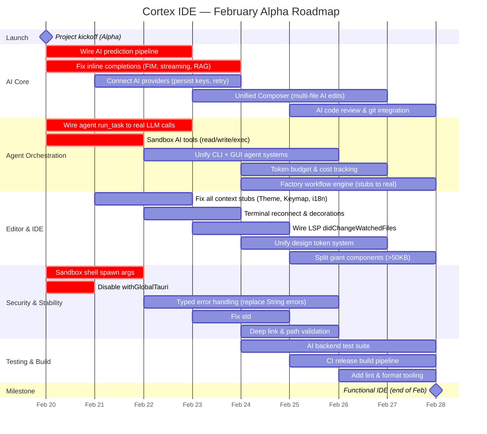

<h1 align="center">
  
</h1>

<h3 align="center">The AI-Native IDE for Agent Orchestration</h3>

  <strong>Cortex IDE</strong> is a specialized development environment designed from the ground up for AI integration and agent orchestration. Our goal is to build the most comprehensive IDE for AI-powered development workflows.

  
  
  

  <a href="#roadmap">Roadmap</a> •
  <a href="#alpha-status">Alpha Status</a> •
  <a href="#bug-bounty">Bug Bounty</a> •
  <a href="https://discord.gg/cortexfoundation">Discord</a> •
  <a href="https://twitter.com/CortexLM">Twitter</a>

---

## Alpha Status

<table>
<tr>
<td>

</td>
</tr>
<tr>
<td>

This project is in **early alpha development** and is **not usable for production**. The alpha version is designed so that miners can test and report all bugs through our [Bug Bounty Program](https://github.com/PlatformNetwork/bounty-challenge). Commits will be **very frequent** during the alpha phase. Expect rapid updates and breaking changes as we iterate quickly toward a stable release.

**No pre-built binaries will be published during the alpha.** Developers must build the project themselves from source.

</td>
</tr>
</table>

---

## Vision

Cortex IDE aims to be the most complete IDE for AI, specialized in **agent orchestration**. Unlike traditional IDEs with AI bolted on, Cortex IDE is built AI-first — every feature is designed around intelligent agent workflows.

---

## Roadmap

### Timeline

### Detailed Roadmap

#### Phase 1 — Critical Fixes (Feb 20–23)

| Area | Task | Status |
|------|------|--------|
| **AI Core** | Wire `ai_predict` to ProviderManager (currently returns null) | 🔄 In Progress |
| **AI Core** | Fix streaming completions (result discarded, double API call) | 🔄 In Progress |
| **AI Core** | Fix debounce logic (stale requests not aborted) | 🔄 In Progress |
| **AI Core** | Add RAG context to inline completions | 🔄 In Progress |
| **AI Core** | Persist provider config & API keys across restarts | 🔄 In Progress |
| **Agents** | Wire `run_task()` to real LLM calls (currently prints "Done") | 🔄 In Progress |
| **Agents** | Replace 2-word agent system prompts with real prompts | 🔄 In Progress |
| **Agents** | Connect ToolRegistry to AgentOrchestrator | 🔄 In Progress |
| **Security** | Sandbox AI tools (read/write/exec) — restrict to workspace | 🔄 In Progress |
| **Security** | Restrict shell spawn `args: true` to allowlists | 🔄 In Progress |
| **Security** | Disable `withGlobalTauri`, use scoped IPC | 🔄 In Progress |
| **Security** | Validate deep link paths | 🔄 In Progress |
| **Engine** | Wire `cortex_engine::Session::run()` (ignores all user input) | 🔄 In Progress |

#### Phase 2 — AI Feature Parity (Feb 23–26)

| Area | Task | Status |
|------|------|--------|
| **AI** | Unified Composer flow (prompt -> multi-file plan -> execute -> review) | 📋 Planned |
| **AI** | Wire `@codebase` mention to RAG context in chat UI | 📋 Planned |
| **AI** | AI commit message generation in GitPanel | 📋 Planned |
| **AI** | AI code review (inline comments in diff editor) | 📋 Planned |
| **AI** | AI conflict resolution in MergeEditor | 📋 Planned |
| **AI** | Image/screenshot support in chat | 📋 Planned |
| **AI** | Retry logic & rate-limit handling for providers | 📋 Planned |
| **Agents** | Unify CLI `cortex-agents` crate into GUI backend | 📋 Planned |
| **Agents** | Token/cost budget management per agent and session | 📋 Planned |
| **Agents** | Factory stubs: wire agent spawn, sub-workflow, approval | 📋 Planned |
| **LSP** | Implement `workspace/didChangeWatchedFiles` | 📋 Planned |
| **Indexer** | Replace hash embeddings with real embedding model | 📋 Planned |
| **Indexer** | Incremental indexing (mtime check, dirty tracking) | 📋 Planned |
| **Indexer** | Fix `.gitignore` parsing (use `ignore` crate) | 📋 Planned |

#### Phase 3 — Polish & Stability (Feb 26–28)

| Area | Task | Status |
|------|------|--------|
| **Editor** | Complete context stubs (Theme, Keymap, i18n, Editor, Notebook) | 📋 Planned |
| **Terminal** | Re-enable command decorations, fix isFocused, add persistence | 📋 Planned |
| **UI** | Unify design token systems (resolve spacing/z-index conflicts) | 📋 Planned |
| **UI** | Define missing `--jb-*` CSS variables for default theme | 📋 Planned |
| **UI** | Split giant components (FileExplorer 117K, MenuBar 111K, etc.) | 📋 Planned |
| **Performance** | Replace `std::sync::Mutex` with `tokio::sync::Mutex` in async | 📋 Planned |
| **Performance** | Fix N+1 IPC patterns in ExtensionsContext | 📋 Planned |
| **Performance** | Lazy-load Tier 5 providers (Debug, Collab, REPL, etc.) | 📋 Planned |
| **Errors** | Typed error handling for Tauri commands (replace 735 String errors) | 📋 Planned |
| **Errors** | Add per-panel ErrorBoundary for sidebar panels | 📋 Planned |
| **Errors** | Surface errors to UI instead of silent console.error | 📋 Planned |
| **Build** | Fix version mismatch (package.json vs Cargo.toml) | 📋 Planned |
| **Build** | Add lint/format tooling (ESLint/Biome) | 📋 Planned |
| **Build** | CI release build pipeline (tauri build on all platforms) | 📋 Planned |
| **Tests** | AI backend test suite (session, completions, providers, agents) | 📋 Planned |
| **Tests** | Factory backend test suite | 📋 Planned |
| **Dead Code** | Remove 12+ dead component files and unused Chat/ directory | 📋 Planned |
| **Dead Code** | Remove `ai/storage.rs` (232 lines, not in mod.rs) | 📋 Planned |
| **Dead Code** | Fix broken Node.js imports in `terminalLinks.ts` | 📋 Planned |

### Post-February Goals

| Target | Milestone |
|--------|-----------|
| **March 2026** | Beta release, extension marketplace seeding, VS Code `.vsix` compatibility |
| **March 2026** | DevContainer support, remote port forwarding |
| **April 2026+** | Next-edit prediction, TextMate grammar loading, community feedback integration |

---

## Bug Bounty

We rely on miners and community members to help us find and report bugs during the alpha phase.

**Report bugs and earn rewards**: [https://github.com/PlatformNetwork/bounty-challenge](https://github.com/PlatformNetwork/bounty-challenge)

---

## Contributing

We welcome contributions from the community! This is an open-source project and every contribution helps shape the future of AI-native development.

---

## License

Copyright © 2025 Cortex Foundation. All rights reserved.
