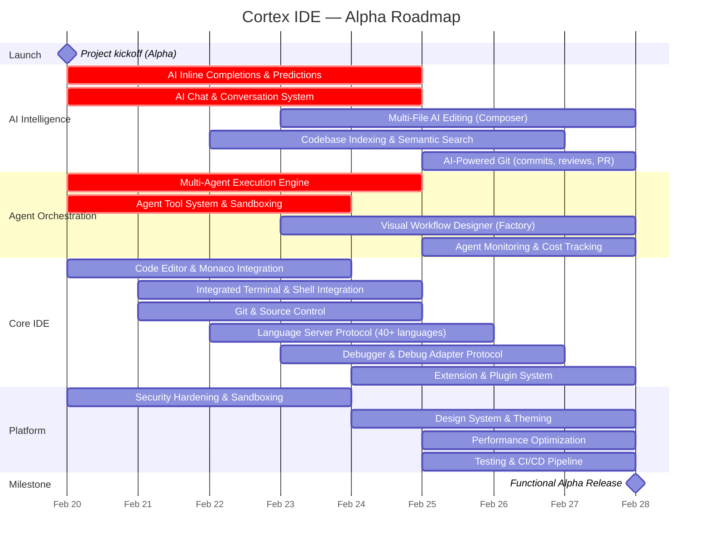

<h1 align="center">
  
</h1>

<h3 align="center">The AI-Native IDE for Agent Orchestration</h3>

  <strong>Cortex IDE</strong> is a specialized development environment designed from the ground up for AI integration and agent orchestration. Our goal is to build the most comprehensive IDE for AI-powered development workflows.

  
  
  

  
  

  <a href="#roadmap">Roadmap</a> •
  <a href="#alpha-status">Alpha Status</a> •
  <a href="#bug-bounty">Bug Bounty</a> •
  <a href="./docs/BUILD.md">Build</a> •
  <a href="./docs/MCP-SERVER.md">MCP Server</a> •
  <a href="https://discord.gg/cortexfoundation">Discord</a> •
  <a href="https://twitter.com/CortexLM">Twitter</a>

---

## Alpha Status

<table>
<tr>
<td>

</td>
</tr>
<tr>
<td>

This project is in **early alpha development** and is **not usable for production**. The alpha version is designed so that miners can test and report all bugs through our [Bug Bounty Program](https://github.com/PlatformNetwork/bounty-challenge). Commits will be **very frequent** during the alpha phase. Expect rapid updates and breaking changes as we iterate quickly toward a stable release.

**No pre-built binaries will be published during the alpha.** Developers must build the project themselves from source.

</td>
</tr>
</table>

---

## Vision

Cortex IDE aims to be the most complete IDE for AI, specialized in **agent orchestration**. Unlike traditional IDEs with AI bolted on, Cortex IDE is built AI-first — every feature is designed around intelligent agent workflows.

---

## Roadmap

### Timeline

### February 2026 — Feature Roadmap

#### AI Intelligence

| Feature | Description | Status |
|---------|-------------|--------|
| **AI Inline Completions & Predictions** | Ghost text suggestions powered by multi-provider LLM backends (OpenAI, Anthropic, Groq, DeepSeek, Mistral, local models). Fill-in-the-middle (FIM) prompts, codebase-aware context injection, Tab/Escape/Alt+] keybindings, smart caching and debouncing. | 🔄 In Progress |
| **AI Chat & Conversation System** | Multi-turn chat panel with streaming responses, thread management, slash commands (/file, /folder, /workspace, /web, /search, /terminal), @-mentions for context, model selection across providers, and prompt templates library. | 🔄 In Progress |
| **Multi-File AI Editing (Composer)** | Unified flow: describe a change in natural language, AI generates a multi-file edit plan, executes changes via tool system, presents diffs for review with accept/reject per file. Integrated undo support. | 📋 Planned |
| **Codebase Indexing & Semantic Search** | Workspace file walking, semantic chunking, vector embeddings, similarity search for RAG-powered AI context. @codebase mentions in chat for codebase-aware answers. Natural language code search. | 🔄 In Progress |
| **AI-Powered Git** | AI commit message generation from staged diffs, PR description auto-generation, AI code review with inline comments in diff editor, AI-assisted merge conflict resolution, diff explanation in plain language. | 📋 Planned |
| **Inline AI Assistant** | Ctrl+K inline edit with quick actions (Explain, Fix, Refactor, Add Types, Document, Optimize), streaming diff preview, accept/reject flow. | 🔄 In Progress |

#### Agent Orchestration

| Feature | Description | Status |
|---------|-------------|--------|
| **Multi-Agent Execution Engine** | Spawn, monitor, and coordinate multiple AI agents working in parallel. Agent types: Code, Research, Test, Review, Custom. DAG-based task dependency resolution, background execution, routing engine for parallel vs sequential dispatch. | 🔄 In Progress |
| **Agent Tool System & Sandboxing** | Built-in tools (read/write files, search, run commands, web fetch, file edit) with workspace-scoped sandboxing, permission system, user approval flow for destructive actions. SSRF protection on network tools. | 🔄 In Progress |
| **Visual Workflow Designer (Factory)** | Canvas-based visual workflow builder with drag-and-drop nodes: triggers, actions, conditions, parallel splits, loops, agent nodes, sub-workflows, approval gates. Execution engine, live monitoring, audit logging. | 📋 Planned |
| **Agent Monitoring & Cost Tracking** | LiveMonitor dashboard with real-time agent status, step history, token usage tracking, cost budgets per agent and session. Pause/resume/cancel controls. Agent Follow mode auto-navigates editor to agent activity. | 📋 Planned |
| **Inter-Agent Communication** | Message passing between running agents, shared semantic context from codebase index, task delegation from parent to child agents, result aggregation. | 📋 Planned |
| **Custom Agents & Rules** | User-defined agents with custom system prompts, tool configurations, and permission levels. Rules library for reusable agent behavior definitions. Prompt store for template management. | 🔄 In Progress |

#### Core IDE

| Feature | Description | Status |
|---------|-------------|--------|
| **Code Editor** | Monaco Editor with syntax highlighting, multi-cursor editing, code folding, minimap, sticky scroll, breadcrumbs, find & replace (regex, preserve case), bracket pair colorization, indent guides, Vim/Emacs keymaps, Zen mode, split/grid editor layout, hex editor, image viewer. | 🔄 In Progress |
| **Integrated Terminal** | xterm.js v6 with WebGL rendering, multiple tabs, split panes, terminal groups, shell integration (OSC 633 for bash/zsh/fish/PowerShell), command detection, CWD tracking, inline completions, auto-reply rules, built-in SSH terminal, inline image rendering (iTerm2/Sixel/Kitty). | 🔄 In Progress |
| **Git & Source Control** | Full Git integration: status, staging (file/hunk/line-level), commit, branch, merge, rebase (interactive), cherry-pick, bisect, stash, tags, worktrees, LFS, submodules. Visual commit graph, inline blame with heatmap, 3-way merge editor, PR management (GitHub/GitLab/Bitbucket). | 🔄 In Progress |
| **Language Intelligence (LSP)** | 40+ built-in language server configurations with auto-download. Full LSP 3.17 support: completions, hover, go-to-definition, references, rename, code actions, semantic tokens, inlay hints, call/type hierarchy, folding, document colors, code lens. Multi-root workspace support. | 🔄 In Progress |
| **Debugger (DAP)** | Full Debug Adapter Protocol client. 5 auto-detected adapters (Node.js, Python/debugpy, Rust/CodeLLDB, C++/GDB, Go/Delve). Breakpoints (line, conditional, logpoint, data, exception), variable inspection, watch expressions, call stack, memory inspector, disassembly view, multi-session. | 🔄 In Progress |
| **Extension & Plugin System** | Multi-tier architecture: WASM sandbox (wasmtime), Web Worker host, Node.js host. 42+ hook types, 18+ granular permissions with user approval, ed25519 plugin signing, marketplace browser, extension profiler, extension bisect debugging. MCP client + server integration. | 🔄 In Progress |
| **File Explorer & Workspace** | Tree view with expand/collapse, file nesting, compact folders, multi-root workspaces, git status indicators, file icons, drag-and-drop, context menus, directory picker. Open editors section, workspace trust system. | 🔄 In Progress |
| **Search** | Project-wide search with regex, case-sensitive, whole word, include/exclude patterns. Semantic search powered by AI. Search editor with editable results. File finder (Quick Open) with fuzzy matching. | 🔄 In Progress |
| **Settings & Configuration** | Full settings editor (GUI + JSON), theme customizer with live preview, keyboard shortcuts editor, user profiles, settings sync. VS Code theme import support. Dark/Light/High Contrast modes. | 🔄 In Progress |
| **Collaboration** | Real-time collaboration via CRDT (Yjs), WebSocket server, presence awareness, cursor overlay, shared editing sessions. Channel-based communication. | 📋 Planned |
| **Remote Development** | SSH remote connections with file operations, SFTP, terminal forwarding. Port forwarding, tunnel management. WSL integration. DevContainer support (planned). | 📋 Planned |
| **Notebook Support** | Jupyter-style notebook editor with code/markdown cells, kernel management (Python, Node.js), cell execution, output rendering (text, HTML, images, JSON, ANSI), notebook diff. | 📋 Planned |
| **Testing** | Test explorer with framework detection (cargo test, pytest, jest, vitest, mocha). Run/debug tests, coverage overlay with line-level indicators, test output panel, watch mode. | 🔄 In Progress |
| **Tasks & Build** | Task runner with tasks.json support, problem matchers, build task integration. Output channels for task logging. | 🔄 In Progress |

#### Platform & Infrastructure

| Feature | Description | Status |
|---------|-------------|--------|
| **Security Hardening** | Content Security Policy, shell spawn restrictions, path traversal protection, workspace trust, process sandboxing (Landlock on Linux, Seatbelt on macOS, ACLs on Windows), credential encryption via OS keychain, deep link validation. | 🔄 In Progress |
| **Design System & Theming** | Unified design token system, Tailwind CSS v4, dark/light/high-contrast/system themes, VS Code theme import, color/token customization per category, icon themes, product icon themes. Responsive layout with resizable panels, glassmorphism floating panels. | 🔄 In Progress |
| **Performance** | Parallel startup initialization, batch IPC with LRU caching, MessagePack serialization for large payloads, Vite code splitting with 20+ manual chunks, lazy-loaded pages and providers, WebGL terminal rendering. | 🔄 In Progress |
| **Internationalization** | Multi-language support (English, French, Chinese, Japanese, Spanish, German), RTL detection, locale-based formatting, fallback system. | 🔄 In Progress |
| **Build & CI/CD** | Tauri v2 desktop builds (macOS, Windows, Linux), Vite frontend bundling, semantic-release versioning, GitHub Actions CI with type checking, formatting, and cross-platform verification. | 🔄 In Progress |
| **Accessibility** | Screen reader support, ARIA live regions, keyboard navigation in all overlays/menus, prefers-reduced-motion support, high-contrast mode, accessibility help dialog. | 🔄 In Progress |

### Post-February Goals

| Target | Milestone |
|--------|-----------|
| **March 2026** | Beta release with stability improvements and community feedback |
| **March 2026** | Extension marketplace seeding with first-party extensions |
| **March 2026** | DevContainer support and remote port forwarding |
| **April 2026** | Next-edit prediction (Cursor Tab equivalent) |
| **April 2026** | TextMate grammar loading for expanded syntax highlighting |
| **April 2026** | AI Bug Finder and natural language code search |
| **Q2 2026** | Extension ecosystem growth, public beta |

---

## Bug Bounty

We rely on miners and community members to help us find and report bugs during the alpha phase.

**Report bugs and earn rewards**: [https://github.com/PlatformNetwork/bounty-challenge](https://github.com/PlatformNetwork/bounty-challenge)

---

## Contributing

We welcome contributions from the community! This is an open-source project and every contribution helps shape the future of AI-native development.

---

## License

Copyright © 2025 Cortex Foundation. All rights reserved.
