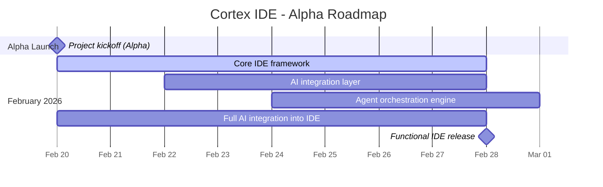

<h1 align="center">
  
</h1>

<h3 align="center">The AI-Native IDE for Agent Orchestration</h3>

  <strong>Cortex IDE</strong> is a specialized development environment designed from the ground up for AI integration and agent orchestration. Our goal is to build the most comprehensive IDE for AI-powered development workflows.

  
  
  

  <a href="#roadmap">Roadmap</a> •
  <a href="#alpha-notice">Alpha Notice</a> •
  <a href="#bug-bounty">Bug Bounty</a> •
  <a href="https://discord.gg/cortexfoundation">Discord</a> •
  <a href="https://twitter.com/CortexLM">Twitter</a>

---

## ⚠️ Alpha Notice

> **This project is currently in early alpha development and is NOT usable for production.**
>
> The alpha version is designed so that miners can test and report all bugs through our [Bug Bounty Program](https://github.com/PlatformNetwork/bounty-challenge).
>
> Commits will be **very frequent** during the alpha phase. Expect rapid updates and breaking changes as we iterate quickly toward a stable release.
>
> **No pre-built binaries will be published during the alpha.** Developers must build the project themselves from source.

---

## Vision

Cortex IDE aims to be the most complete IDE for AI, specialized in **agent orchestration**. Unlike traditional IDEs with AI bolted on, Cortex IDE is built AI-first — every feature is designed around intelligent agent workflows.

---

## Roadmap

### Timeline

### Detailed Roadmap

| Date | Milestone | Status |
|------|-----------|--------|
| **Feb 20, 2026** | Project kickoff — Alpha development begins | ✅ Done |
| **Feb 20–28** | Integrate all AI aspects into the IDE | 🔄 In Progress |
| **Feb 20–28** | Agent orchestration system | 🔄 In Progress |
| **Feb 28, 2026** | IDE functional and usable for testing | 📋 Planned |
| **March 2026+** | Beta release, stability improvements, community feedback | 📋 Planned |

### February Goals

- **Full AI Integration**: Embed AI capabilities deeply into every layer of the IDE — code completion, agent chat, inline suggestions, and autonomous task execution.
- **Agent Orchestration**: Build a first-class orchestration system to manage, coordinate, and monitor multiple AI agents working in parallel.
- **Functional IDE by end of February**: The IDE will be functional enough to be used and tested by the community.

---

## Bug Bounty

We rely on miners and community members to help us find and report bugs during the alpha phase.

🔗 **Report bugs and earn rewards**: [https://github.com/PlatformNetwork/bounty-challenge](https://github.com/PlatformNetwork/bounty-challenge)

---

## Contributing

We welcome contributions from the community! This is an open-source project and every contribution helps shape the future of AI-native development.

---

## License

Copyright © 2025 Cortex Foundation. All rights reserved.
